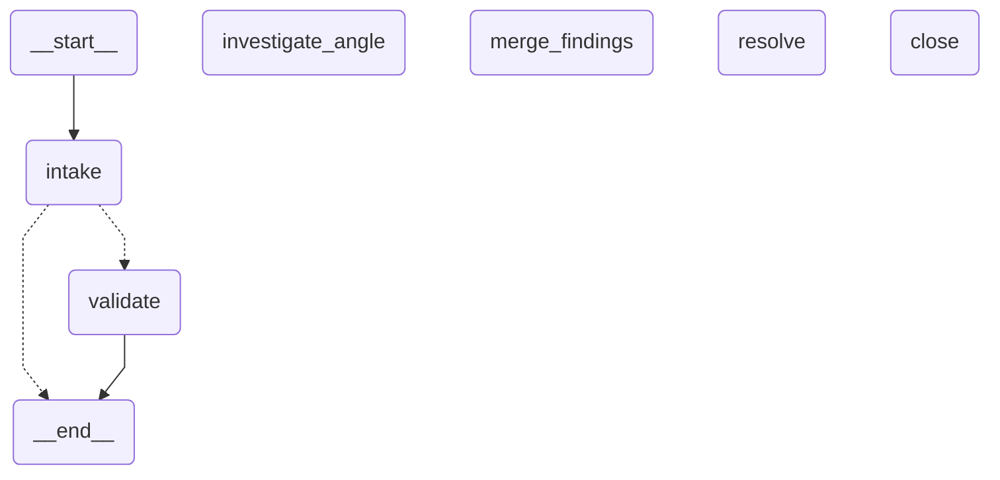

# NormalObjects — Bloyce's Protocol Workflow

```mermaid
---
config:
  flowchart:
    curve: linear
---
graph TD;
	__start__(<p>__start__</p>)
	intake(intake)
	validate(validate)
	investigate_angle(investigate_angle)
	merge_findings(merge_findings)
	resolve(resolve)
	close(close)
	__end__(<p>__end__</p>)
	__start__ --> intake;
	intake -.-> __end__;
	intake -.-> validate;
	validate --> __end__;
	classDef default fill:#f2f0ff,line-height:1.2
	classDef first fill-opacity:0
	classDef last fill:#bfb6fc

```
